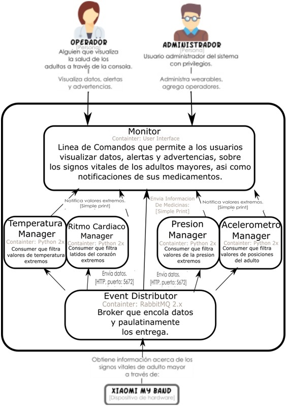

# Arquitecturas Publica - Suscribe

## Tarea 1

Implementación del sensor de acelerómetro al Sistema de Monitore de Adultos Mayores (SMAM). A continuación se muestra el diagrama de contenedores del SMAM Actualizado.

## Versión

2.0.3 - Marzo 2018

## Autores

* **Alejandro Pinedo**
* **Oscar Ulloa**
* **Armando Rodarte**
* **Daniel Hernandez**
